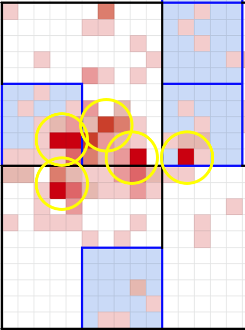
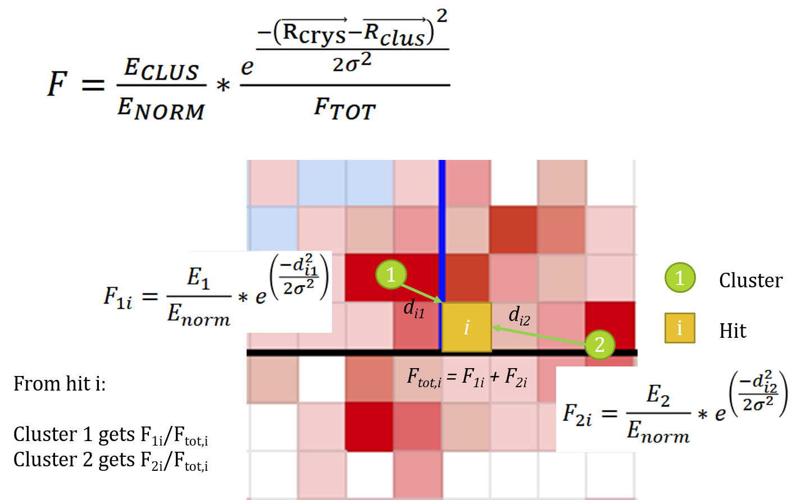
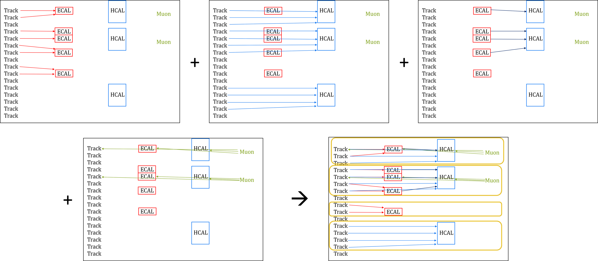

> ## Particle Flow in CMS
> The CMS particle-flow algorithm aims to identify and reconstruct individually all of the particles produced in a collision, through an optimal combination of the information from
> the entire detector. These particles are then used to build higher-level physics objects, such as jets, and the missing transverse momentum, with superior resolution.
>
> *[Bachtis et al, CERN Courier 2016](https://cds.cern.ch/record/2232592/files/vol56-issue5-p027-e.pdf)*
{: .callout}

The concept of "particle flow" began at LEP, and has been used consistently by CMS. This method maps the mental picture of a particle "flowing" through multiple subdetectors onto the reconstruction method. Particle flow allows the resolution of tracking detectors and electromagnetic calorimeters to supplement information from hadronic calorimeters when reconstructing jets, missing transverse energy, tau leptons, and estimating pileup contributions.

The PF algorithm takes in tracks from the inner tracker, ECAL energy deposits, HCAL energy deposits, and muon chamber tracks. First, the calorimeter energy deposits are connected into clusters, and then all of the tracks and clusters are linked to each other based on spatial proximity. Blocks can be formed from groups of linked tracks and clusters, and from these blocks particle candidates can be separated out. The resulting list of "particle flow candidates" becomes the input to any event interpretation algorithms in CMS, such as jet clustering.

## Clustering

Clustering proceeds in three basic steps:
 * Identify topological clusters: a topological cluster is a group of calorimeter cells, each registering an energy deposit above a certain threshold, that share at least one neighbor.
 * Identify seeds: a "seed" is any calorimeter cell whose energy is a local maximum, with respect to its immediate neighbors. Topological clusters must have 1 seed, but may have multiple.
 * Compute cluster positions and energies: easier said than done!
    * Single-seed topological clusters: the cluster energy is the sum of all the individual cell energies within the topological cluster, and the cluster position is found from the energy-weighted average of the individual cell positions.
    * Multiple-seed topological clusters: each seed is assumed to represent a unique energy cluster, but the energy deposited in non-seed cells must be shared between the various clusters within the topological cluster. An iterative procedure is used to converge on cluster energies and positions based on energy-weighted averages of fractional cell energies. The images below show an example of this type of cluster, with cells represented as squares in $$\eta-\phi$$ space.

## Links and Blocks

Linking is the procedure of connecting together tracks and clusters based on their spatial proximity. This is almost simpler to do "by eye" than computationally! In practice,
a web of links is created between tracks and clusters, something like a dense neural network map, and only the "shortest" links are kept. 
In simplified language, the following "rules" show which links would be kept in particle flow:  

> ## Linking Rules
> Connect a small thing to one big thing
> They must be "touching" in $$\eta-\phi$$ space! (+1 cell buffer zone is ok too)
> The closest big thing wins the link!
{: .checklist}

Links can be formed between tracks and ECAL clusters, tracks and HCAL clusters, ECAL clusters and HCAL clusters, inner tracks and muon tracks, muon tracks and ECAL clusters, and muon tracks and HCAL clusters. After all the links are established, "blocks" are formed from all groups of linked tracks and clusters:

Blocks are also constructed from any "lone" elements, such as single tracks or single clusters. 

## Candidate formation

Next, blocks are redivided into particle candidates, following a strict order of decision making. After checking, in order, for each type of particle listed below, the tracks/clusters associated with each newly formed candidate are removed from their blocks. 

### Muons

Inner tracks linked to muon tracks are called "Global Muons". If there is little calorimeter energy nearby, all linked ECAL and HCAL clusters are assigned to the muon. In regions with significant calorimeter activity, clusters linked directly to the muon tracks as assigned to the muon if it passes the "tight" identification working point.

> ## Muon momentum and direction
> * Inner track momentum and angles are assigned for muon with pT < 200 GeV
> * Very high pT muons need more care (FIXME)
{: .callout}

### Isolated electrons and photons

ECAL clusters that are not linked to HCAL clusters are considered isolated electrons or photons. A photon candidate is formed if there are no track links and the ECAL cluster has at least 10 GeV of energy. An electron candidate is formed if a 2+ GeV track is linked to the ECAL cluster, and its momentum is very similar to the ECAL cluster's energy. The algorithm accounts for bremsstrahlung radiation and pair production within the tracker when assigning block elements to electrons.

> ## Electron and photon momentum and direcion
> * Photons: calibrate the ECAL cluster's energy, and assign the cluster's energy and direction to the photon.
> * Electrons: calibrate the ECAL cluster's energy and assign that energy to the electron, but assign the track's direction.
{: .callout}

### Neutral hadrons and photons

Next particle flow considers all other clusters without track links. Any such ECAL cluster is assigned as a photon candidate, and any such HCAL cluster is assigned as a neutral hadron candidate.

> ## Neutral candidate energy and direction
> Calibrate the ECAL or HCAL energy and assign the cluster's energy and direction to the photon or neutral hadron.
{: .callout}

### Charged hadrons

Everything that's left are charged hadrons!

At this point, all the tracks and clusters related to muons, electrons, photons, and neutral hadrons have been removed from the PF blocks. The remaining question is how many charged hadrons to assign in each block, and what their properties should be. First, the energy must be calibrated: the sum of cluster energy is compared to the sum of track momenta and the larger of those two values is used to calibrate the energy of the cluster group. Then, 3 cases can be considered:

1. **The track momentum sum is smaller than the calibrated cluster energy sum.** In this case, each track is assigned as a charged hadron candidate carrying the track's momentum and direction. The excess energy (calculated assuming the tracks represent charged *pions*) from clusters links to each track is assigned as photon candidates and neutral hadron candidates, depending on the type of clusters that are found.

2. **The track momentum sum agrees with the calibrated cluster energy sum**, within the energy resolution. In this case, each track is assigned as a charged hadron candidate carrying the track's momentum and direction.

3. **The track momentum sum is larger than the calibrated cluster energy sum**. This indicates that either a muon or a track has been significantly mismeasured! The algorithm walks through several checks of track uncertainties and other features to try and remedy the error.

The final step in candidate formation is to assign "lone" tracks as charged hadrons carrying the track's momentum and direction.

> ### Charged hadron energy and direction
> Typically, charged hadrons are assigned the momentum and direction of their linked track, assuming the pion mass.
> Excess cluster energy can be assigned as photons and/or neutron hadrons, using the calibrated cluster energy and direction.
{: .callout}

## Event interpretation

The particle flow candidates can now be fed into any event-wide algorithm you list: jet clustering, MET calculations, hadronic tau reconstruction, pileup mitigation techniques, neural network jet taggers, and many more. If you would like to learn more about this topic, the [Particle Flow paper](https://arxiv.org/abs/1706.04965) is a great read!

## POET particle flow candidates

In MiniAOD files, the particle flow candidates are accessible through the `packedPFCandidates` collection. Particle flow is run in the "RECO" step of CMS data processing, but specific information about the candidates are kept in AOD and MiniAOD files. A summary of the information available in MiniAOD files can be found on the [2015 MiniAOD Workbook TWiki](https://twiki.cern.ch/twiki/bin/view/CMSPublic/WorkBookMiniAOD2015#Packed_ParticleFlow_Candidates).

The `PackedCandidateAnalyzer` is configured in `poet_cfg.py` to access this collection:

~~~
process.mypackedcandidate = cms.EDAnalyzer('PackedCandidateAnalyzer',
                                           packed=cms.InputTag("packedPFCandidates")
                                           )
~~~
{: .language-python}

The analyzer itself is simple, pulling out kinematic and labelling information for each candidate. More methods exist and are documented in the [PAT::PackedCandidate class](https://github.com/cms-sw/cmssw/blob/CMSSW_7_6_X/DataFormats/PatCandidates/interface/PackedCandidate.h). 

~~~
   for (const pat::PackedCandidate &pack : *packed)
   {
         packed_pt.push_back(pack.pt());
         packed_eta.push_back(pack.eta());
         packed_mass.push_back(pack.mass());
         packed_energy.push_back(pack.energy());
         packed_phi.push_back(pack.phi());
         packed_ch.push_back(pack.charge());
         packed_px.push_back(pack.px());
         packed_py.push_back(pack.py());
         packed_pz.push_back(pack.pz());
         packed_theta.push_back(pack.theta());
         packed_vx.push_back(pack.vx());
         packed_vy.push_back(pack.vy());
         packed_vz.push_back(pack.vz());
         packed_lostInnerHits.push_back(pack.lostInnerHits());
         packed_PuppiWeight.push_back(pack.puppiWeight());
         packed_PuppiWeightNoLep.push_back(pack.puppiWeightNoLep());
         packed_hcalFraction.push_back(pack.hcalFraction());
         packed_pdgId.push_back(pack.pdgId());
       numCandidates++;
    }
~~~
{: .language-cpp}

> ## What are PF Candidate PDG IDs?
> * 11, 13 = electron, muon
> * 22 = photon
> * 130 = neutral hadron
> * 211 = charged hadron
> * 1 = hadronic particle reconstructed in the forward calorimeters
> * 2 = electromagnetic particle reconstructed in the forward calorimeters
{: .callout}

> ## Run POET with PF candidates included
> We will need to uncomment the PF candidate analyzer in the path at the bottom of `poet_cfg.py`. Your path for MC should look like this:
> ~~~
> else:
> process.p = cms.Path(process.hltHighLevel+process.elemufilter+process.mysimpletrig+
>        process.myelectrons+process.mymuons+process.mytaus+process.myphotons+process.mypvertex+process.mygenparticle+
>        process.looseAK4Jets+process.patJetCorrFactorsReapplyJEC+process.slimmedJetsNewJEC+process.myjets+
>        process.looseAK8Jets+process.patJetCorrFactorsReapplyJECAK8+process.slimmedJetsAK8NewJEC+process.myfatjets+
>        process.uncorrectedMet+process.uncorrectedPatMet+process.Type1CorrForNewJEC+process.slimmedMETsNewJEC+process.mymets
>        +process.mypackedcandidate
>       )
> ~~~
> {: .language-python}
>
> Run poet over 100 MC events (set `maxEvents` back to 100!)
> ~~~
> cmsRun python/poet_cfg.py True
> ~~~
> {: .language-bash}
>
> Open `myoutput.root` and try to plot the PF candidate PDG ID -- how do the abundances vary?
> It is also interesting to compare the size `myoutput.root` with and without including the PF candidates -- we do not include them by default since they can increase the file size by a significant amount!
{: .challenge}



